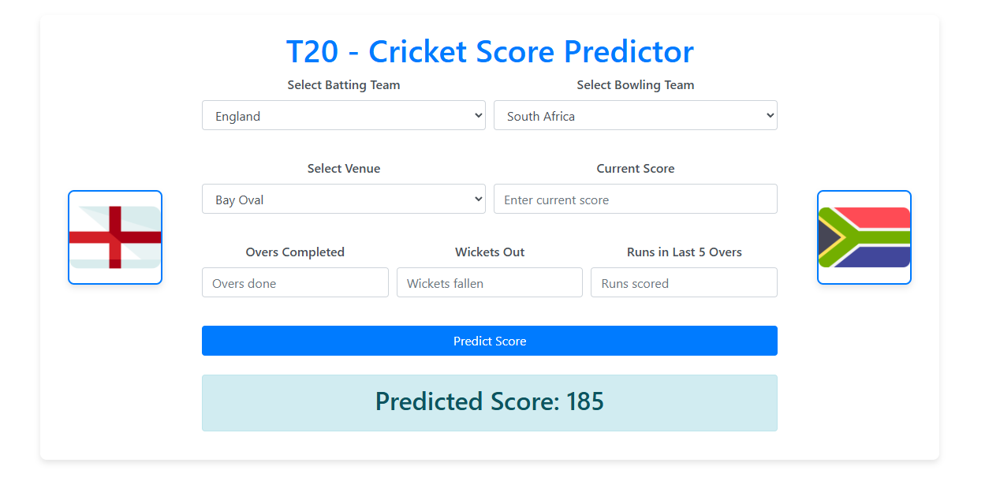

# T20 Cricket Score Predictor



This project is a web-based T20 Cricket Score Predictor that uses machine learning to predict the final score of a T20 cricket match based on the current match situation. The predictor considers various factors such as the teams, venue, current score, overs completed, wickets fallen, and runs scored in the last five overs.

## Features

- **Team Selection:** Users can select the batting and bowling teams from a list of available teams.
- **Venue Selection:** Users can choose the venue where the match is being played.
- **Current Match Details:** Users can input the current score, overs completed, wickets fallen, and runs scored in the last five overs.
- **Score Prediction:** Based on the inputs, the model predicts the final score of the batting team.
- **Dynamic Team Images:** The web app displays images corresponding to the selected teams.

## Installation and Setup

1. **Clone the Repository:**

   ```bash
   git clone https://github.com/YasiruLaksara/T20-Cricket-Score-Predictor.git

   ```

2. **Run the Web Application:**
   python app.py

3.**Access the Web App:**
Open your browser and go to http://127.0.0.1:5000/.

## Model Training

The predictor uses a machine learning model(Random ForestRegressor) trained on historical T20 match data. The training process includes the following steps:

1. **Data Collection:** Historical T20 match data was collected and preprocessed for model training.
2. **Feature Selection:** Relevant features were selected to enhance the model's predictive capabilities. The features created include:
   - **Team Names:** Categorical variables representing the batting and bowling teams.
   - **Venue:** Categorical variable indicating the venue where the match is played.
   - **Current Score:** Numerical value representing the current score of the batting team.
   - **Overs Completed:** Numerical value representing the number of overs completed in the match.
   - **Wickets Fallen:** Numerical value representing the number of wickets fallen.
   - **Runs Scored in the Last Five Overs:** Numerical value indicating the runs scored by the batting team in the last five overs.
   - **New Features Created:**
     - **Current Score Per Over:** Calculated by dividing the current score by the number of overs completed to capture scoring rate.
     - **Run Rate in Last Five Overs:** The average run rate during the last five overs, providing insight into recent scoring trends.
     - **Wickets Remaining:** The difference between the total number of wickets and the wickets fallen, which can indicate the batting team's stability.

## Files

- `app.py`: The Flask application file that handles the web interface and interactions with the model.
- `code.ipynb`: A Jupyter notebook containing the model training and evaluation code.
- `index.html`: The HTML file that defines the structure and layout of the web interface.

## Usage

1. **Start the Web Application:** Follow the steps in the "Installation and Setup" section to start the web app.
2. **Input the Current Match Details:** Enter the current match information in the form provided on the web page.
3. **Predict the Score:** Click on "Predict Score" to get the predicted final score.
4. **View the Prediction:** The predicted score will be displayed on the screen.

## Future Enhancements

- **Adding More Features:** Incorporate additional match features such as player performance etc., to improve prediction accuracy.

### Model Improvement

- **Cross-Validation and Model Selection:** The current implementation uses a Random Forest Regressor directly for predictions. In future enhancements, cross-validation can be employed more thoroughly to find the best model by evaluating multiple algorithms, such as Gradient Boosting, XGBoost, or Support Vector Machines (SVM).
- **Hyperparameter Tuning:** Fine-tuning hyperparameters using techniques like Grid Search or Random Search to optimize model performance.
- **Ensembling Techniques:** Implementing ensemble methods, such as stacking, bagging, or boosting, can further enhance prediction accuracy by combining the strengths of multiple models.
- **Deep Learning:** Exploring deep learning techniques like neural networks for potential improvements in model predictions, especially for capturing complex patterns in the data.

These improvements aim to build upon the existing Random Forest Regressor implementation and provide a more robust and accurate prediction model.
